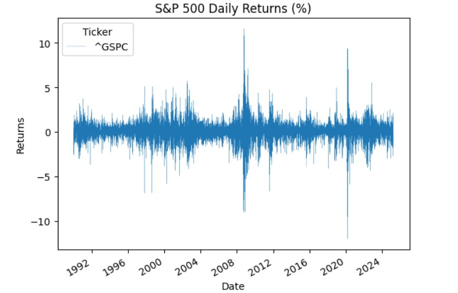
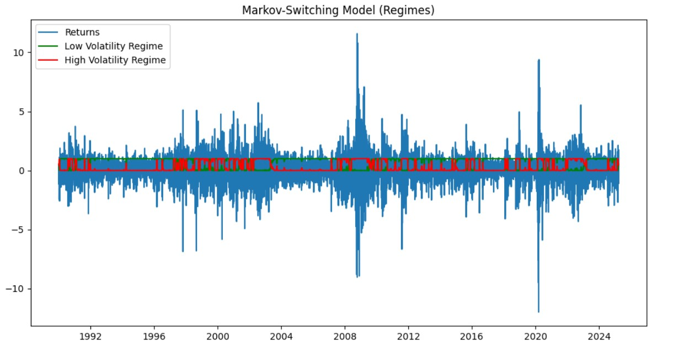
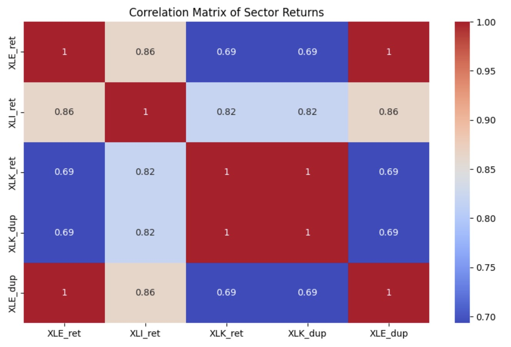
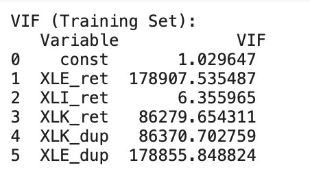
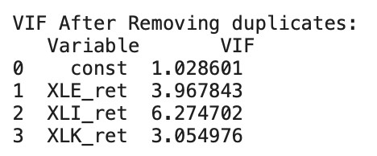
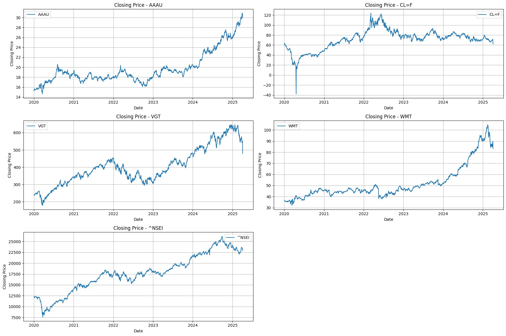

# Time-Series-Analysis-2

## (A) Undergoing a Regime Change:
### 1. Definition:

Regime-switching models are a class of statistical models that allow
parameters to change over time based on unobserved (latent) states or
regimes. These models are widely used in economics, finance,
environmental science, and other fields to capture structural changes,
cyclical behavior, or sudden shifts in data-generating processes. Markov-Switching Autoregressive (MSAR) is very popular model to analyze
regime switch in financial markets. 

### 2. Description:

For this report we will use MSAR model to understand regime switch for
S&P500. This model is widely used in finance and economics to capture
structural breaks, business cycles, and volatility regimes.

**(A) Observable Equation (AR Process)**

The observed time series follows an autoregressive (AR) process, but its
parameters depend on the hidden state $𝑆_𝑡$:

$&emsp;&emsp;&emsp;&emsp;&emsp;&emsp;&emsp;&emsp;&emsp;&emsp;$ 
𝑦𝑡^:^ = µ𝑆𝑡 + ϕ1, 𝑆𝑡𝑦𝑡 − 1 + ϕ2, 𝑆𝑡𝑦𝑡 − 2 + ⋯ + ϕ𝑝, 𝑆𝑡𝑦𝑡 − 𝑝 + σ𝑆𝑡ϵ𝑡

where:

-St ∈ {1, 2, ..., K} is the latent state at time t.

-μ𝑆𝑡: State-dependent mean.

-ϕ1, 𝑆𝑡, ... , ϕ𝑝, 𝑆𝑡ϕ1, 𝑆𝑡, ..., ϕ𝑝, 𝑆𝑡: State-dependent AR
coefficients.

-σ𝑆𝑡: State-dependent volatility.

-ϵ𝑡∼(0, 1): 𝑆𝑡𝑎𝑛𝑑𝑎𝑟𝑑 𝑛𝑜𝑟𝑚𝑎𝑙 𝑛𝑜𝑖𝑠e

### 3. Demonstration and Diagram:

For Demonstration purpose we have used S&P 500 data extracted using
yahoo finance for the period \'1990-01-01\' to \'2025-03-28.
**Figure1:**

**Figure2:**

Figure1 represents the daily return for S&P500.Figure2 is a
regime-switching plot from a Markov-Switching Model applied to financial
returns for S&P 500.The Green line represents probability of being in
the low-volatility regime which means market will be stable. The Red
line depicts probability of being in the high volatility regime which
means crises or turbulence times in the market.
For trading desk this help to give indication to buy in low-volatility
regimes, hedge in high-volatility regimes.

### 4. Diagnosis:

-   We need to check if the model residuals behave like white noise (no
    autocorrelation, homoscedasticity).

-   Check if transition probabilities are stable over time.

-   Evaluate how well the model separates regimes.

-   Balance goodness-of-fit.

-   Validate regime persistence and transitions.

### 5. Damage:

-   Incase Model mislabels noise as regimes, it will lead to a false
    \"high volatility\" regime signal and in turn could prompt premature
    exit from profitable positions.

-   Poorly estimated volatility regimes or transition probabilities can
    overestimate/underestimate Risk.

-   Overfitting (too many regimes) or under-fitting (too few) can lead
    to Spurious regimes demand or missed regime shifts.

### 6. Directions:

-   Test the model with unseen data.

-   Verify the regimes with known events.

-   Avoid skipping the diagnostic as it turns MSM into a \"black box\"
    that risks capital, credibility, and compliance.

### 7. Deployment:

Post all the checks and validation, this model can be used to provides
an edge in regime-aware investing, hedging, and forecasting.

## (B) Handling multicollinearity:

### 1. Definition:

Multicollinearity occurs when two or more predictor variables in a
regression model are highly correlated, meaning they contain overlapping
information. This makes it difficult for the model to determine the
individual effect of each variable, leading to unstable or unreliable
coefficient estimates and reducing the model's interpretability and
predictive power. In mathematical terms, consider a linear regression
model:

$&emsp;&emsp;&emsp;&emsp;&emsp;&emsp;&emsp;&emsp;&emsp;&emsp;$ 
$𝑦 = ω_1𝑥_1 + ω_2𝑥_2 + ....... + ω_𝑛𝑥_𝑛 + 𝑏$,

Multicollinearity arises when ∃ 𝑖 ≠ 𝑗: 𝐶𝑜𝑟($𝑥_𝑖 , 𝑥_𝑗 $) ≈ ± 1 , where Corr
denotes the correlation between two random variables. This near-linear
dependence between features makes the model\'s coefficient estimation
highly sensitive to small changes in the data.

### 2. Description:

Multicollinearity increases the variance of the estimated coefficients,
meaning the values they can take become more spread out and unstable
(Kutner et al.). As a result, the estimates become less reliable, making
it difficult to determine the true effect of individual predictors. This
can lead to misleading interpretations, such as incorrect signs or
magnitudes of the coefficients.

### 3. Demonstration and Diagram:

A compelling way to demonstrate the effects of **multicollinearity** is
by modeling **S&P 500 returns** using **sector ETF returns** as
predictors (Sharpe). We use daily adjusted close prices for SPY and
sector ETFs from Yahoo Finance (Yahoo Finance). Sector ETFs such as
Technology (XLK), Industrials (XLI), and Energy (XLE) often exhibit a
high degree of correlation, which creates an ideal setup to highlight
the issue. To better visualize the impact of multicollinearity, I
intentionally added two artificially constructed predictors ---
duplicates of XLK and XLE with slight noise --- making them highly
correlated with the originals. Without applying any preprocessing or
regularization, I trained a linear regression model on this dataset. You
can see a full description of the model in the Jupyter Notebook. The
condition number of the design matrix is extremely high (1.57e+04),
indicating numerical instability. The model coefficients are unusually
large, with inflated standard errors. Small changes in the input data
could lead to dramatically different coefficient estimates. This setup
effectively demonstrates how multicollinearity can mislead
interpretation, cause instability in estimation, and negatively affect
out-of-sample predictive performance, even when in-sample metrics (like
R²) seem acceptable. This setup effectively demonstrates how
multicollinearity can mislead interpretation, cause instability in
estimation, and negatively affect out-of-sample predictive performance,
even when in-sample metrics (like R²) seem acceptable.

### 4. Diagnosis:

To determine whether there really is a problem and where to look for it,
first of all we will build a correlation matrix. This matrix shows
whether there is a linear relationship between two variables.

To detect the issue, we compute the VIF (Variance Inflation Factor),
which measures how much the variance of a regression coefficient is
inflated due to multicollinearity with other predictors (Kutner et al.).

### 5. Damage:

-   Unstable coefficient estimates -- Small changes in the data can lead
    to large swings in coefficients.

-   Incorrect signs or magnitudes -- Coefficients may have signs that
    contradict theory or expectations.

-   Inflated standard errors -- Makes it harder to identify
    statistically significant predictors.

-   Numerical instability -- Can lead to problems during matrix
    inversion (e.g., large condition number).

-   Overfitting risk -- Model may perform well in-sample but poorly
    out-of-sample.

### 6. Directions:

To solve this problem, we can remove highly correlated features and
retain only one of them, or we can create a new combined feature that
captures their shared information --- for example, by applying Principal
Component Analysis (PCA) (James et al.). We also can use some
regularizations, for example, Ridge regression, to reduce coefficient
values. Let's drop the duplicated features and examine the results: the
condition number decreased significantly (to 108), all coefficients are
now below 1, and the standard errors are much smaller. This indicates
that the model is more stable and better suited for reliable
predictions. Also let's estimate VIF factors:

### 7. Deployment:

The cleaned and stable model can be used to predict returns. It's
suitable for Portfolio allocation, Risk monitoring or trading signal
generation. With multicollinearity removed, the model provides more
reliable and interpretable predictions, making it ready for use in daily
market analysis or automated pipelines.

## (C) Modeling non-stationarity and finding an equilibrium:

### 1. Definition:

A non-stationarity time series is a series which does not have constant
mean and variance. A non-stationary time series has long term trends,
seasonality and often has a unit root of the characteristic equation. If
the two or more non stationary series are co-integrated then in the long
term they move together even if in the short term they may deviate from
each other. This is called mean reversion property or finding an
equilibrium.

### 2. Description:

The two non-stationary time series are said to be co-integrated if there
is a linear combination of two which makes the relationship stationary.
Now, there are two ways to model such datasets. First, make both of the
time series stationary with differencing and building a VAR model.
Second, using co-integration and building ECM or VECM models. Both ECM
and VECM have an error correction term that will measure the deviation
from mean and adjust the future values to reach equilibrium.

### 3. Demonstration and Diagram:

For demonstration, we used real world data of five stocks, Vanguard
Information Technology Index Fund ETF (VGT), Crude Oil May 25 (CL=F), Goldman Sachs Physical Gold ETF (AAAU), Walmart
Inc. (WMT) and NIFTY 50 (\^NSEI) from 1st Jan 2020 to 7th April 2025.
The above figure shows the time plot of the stock price of five stocks.
From the graph, the stock prices show an upward trend with some high
variance time sections. When building a VAR model, we made all the time
series stationary using 2nd order differencing and used the differenced
time series as input to the model. From the model summary we got a lag
of six as optimum value and used it to fit the VAR (6) model. One can
find all the variable equations and significant variables from the model
in the accompanied python file. Next, we build the ECM model using first
order differenced time series of VGT and \^NSEI (still all
non-stationary) as input to the model. We checked their co-integration
using the EG Test for co-integration. In the Phillips and Ouliaris
method and the table (PO test), we got p value less than critical value
so co-integration is present. From the results, we can see all
coefficient estimates are significant and lambda, Λ is VGT.L1 = -1.1918.
Then from the Durbin-Watson test, we found no autocorrelation among
residuals. See accompanied python file for detailed analysis.

### 4. Diagnosis:

-   In the VAR model, check for stationarity of time series using ADF
    and KPSS test.

-   In ECM model, check for co-integration using EG test for
    co-integration and Phillips and Ouliaris method and the table (PO
    test).

-   Then using the Durbin-Watson test, Check if the model residuals
    behave like white noise (no autocorrelation, homoscedasticity)

-   Evaluate model parameters like AIC, BIC, lambda, coefficient of
    variables, goodness of fit etc.

### 5. Damage:

-   Since the underlying statistics like mean and variance are not
    constant over time, you cannot fit a regression line, and the
    forecast will have unreliable results as previous data can be
    significantly different from present or future data.

-   Like regression, one cannot do statistical inferences like
    hypothesis testing reliably because no constant mean and variance
    violates the assumptions required.

-   Another problem is there is no easy or simpler model present to
    model multiple non-stationarity time series. We need models like VAR
    which requires stationary time series or ECM and VECM models which
    can tackle non stationary time series directly.

### 6. Directions:

-   Try different transformation techniques like log transformation,
    squared or box-cox transformation which can make the series
    stationary then build VAR model

-   Try differencing (1st order, 2nd order) which can remove
    non-stationary from trends and seasonality for VAR model.

-   Use models like ECM and VECM, which takes care of non-stationarity
    by using co-integration of underlying variables. There are state
    space models which are dynamic and take care of all types
    non-stationary but are complex to implement. In the python file we
    used ECM model with 1st order differencing because it has lowest
    AIC.

-   Check the forecast values with the actual unseen data to see model
    performance.

-   We can use RNN and Deep learning techniques to model non stationary
    time series.

### 7. Deployment:

Both VAR and ECM models can be used to forecast future stock prices and
ECM models particularly can measure the deviation in one stock relative
to deviation in other stock. It is useful in pairs trading and finding
equilibrium in the long run.

## **References:**

1.  Greene, William H. *Econometric Analysis*. 8th ed., Pearson
    Education, 2018.

2.  James, Gareth, et al. *An Introduction to Statistical Learning: With
    Applications in R*. Springer, 2013.

3.  Kutner, Michael H., et al. *Applied Linear Statistical Models*. 5th
    ed., McGraw-Hill Irwin, 2005.

4.  Sharpe, William F. "Capital Asset Prices: A Theory of Market
    Equilibrium under Conditions of Risk." *The Journal of Finance*,
    vol. 19, no. 3, 1964, pp. 425--442.

5.  Yahoo Finance. *Finance Data APIs*.
    [[https://finance.yahoo.com]{.underline}](https://finance.yahoo.com/).
    Accessed 7 Apr. 2025.
